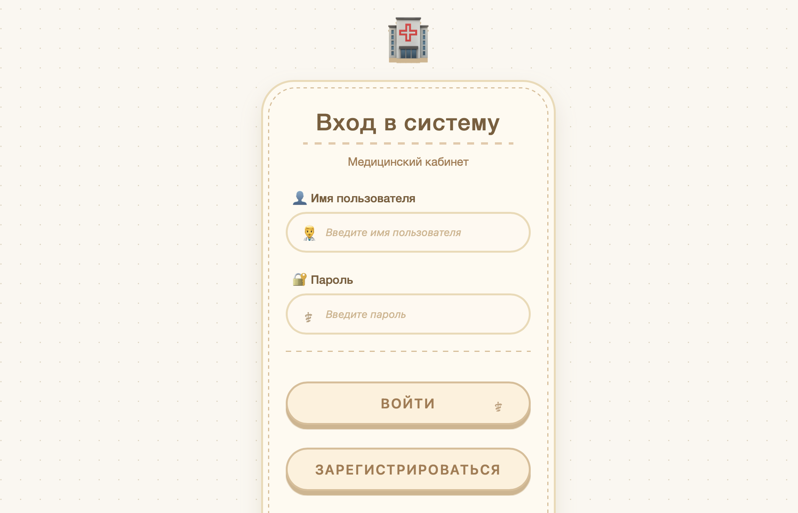
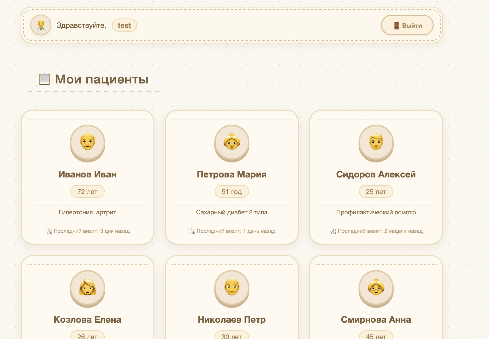
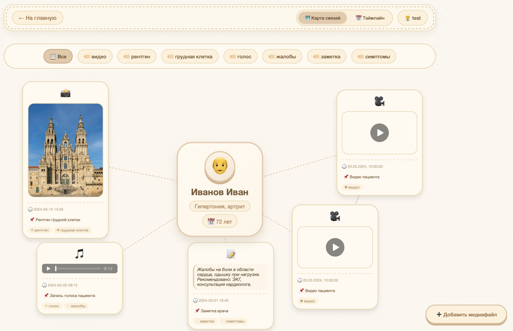
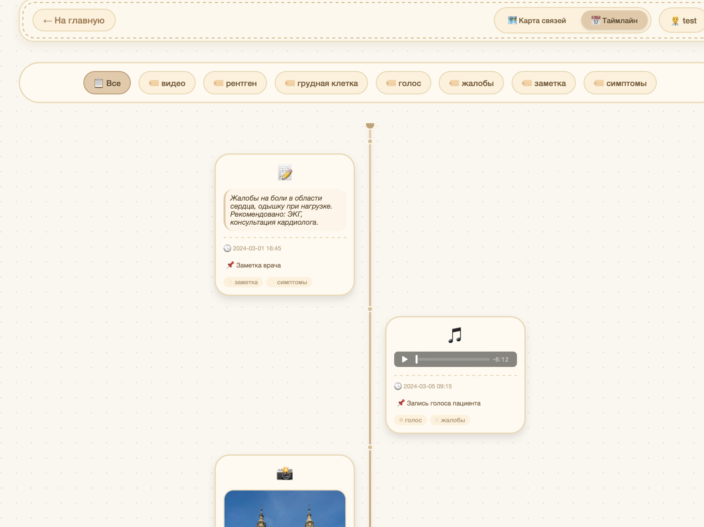
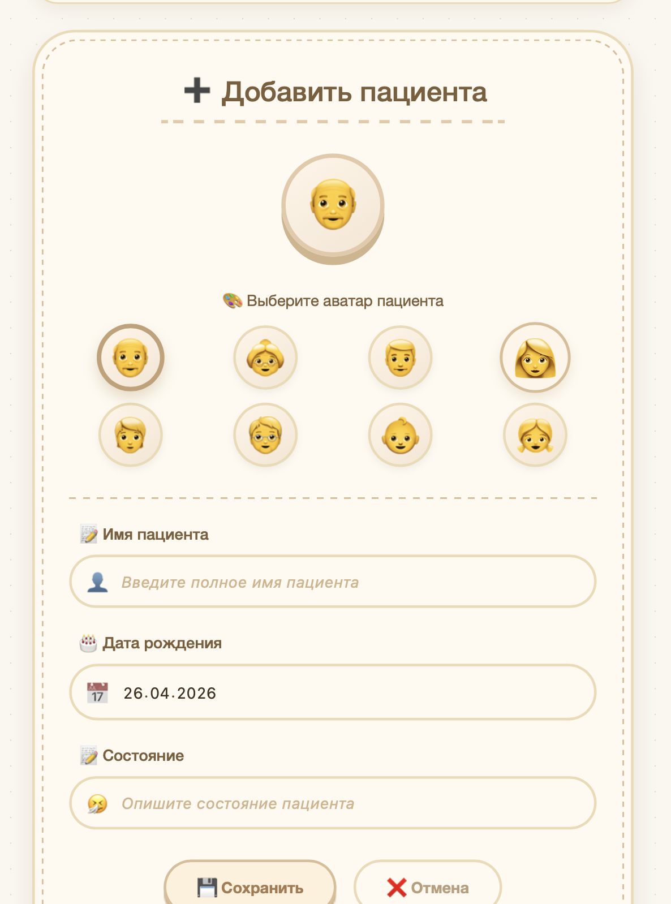

# 📋 Медицинская карта пациента — система для хранения медиафайлов

> Проект предназначен для медицинских работников: позволяет вести список пациентов, хранить их фото, аудио, видео и заметки, а также просматривать файлы в двух режимах — «Drag-n-Drop» и «Таймлайн».

## 🚀 Основной функционал

- Регистрация и аутентификация врачей (JWT, куки)
- Список пациентов с информацией: аватар, ФИО, возраст, статус
- Добавление новых пациентов
- Просмотр и загрузка медиафайлов пациента:
  - Фото
  - Аудио
  - Видео (с поддержкой потокового воспроизведения)
  - Текстовые заметки
- Два режима просмотра файлов:
  - **Drag‑n‑Drop** — удобная сортировка и группировка
  - **Таймлайн** — хронологический порядок добавления

## 🧱 Технологический стек

| Компонент       | Технологии                                 |
|----------------|--------------------------------------------|
| Backend        | Java 25, Spring Boot, Spring WebMVC        |
| Frontend       | Spring MVC (Thymeleaf), HTML/CSS           |
| Аутентификация | JWT (хранится в cookies)                  |
| Взаимодействие | WebClient (синхронные вызовы)              |
| Данные (in-memory) | ConcurrentHashMap, AtomicLong          |

## 🖼️ Скриншоты

*Рис. 1 — Страница входа и регистрации*

*Рис. 2 — Главная страница со списком пациентов*

*Рис. 3 — Просмотр файлов с возможностью перетаскивания*

*Рис. 4 — Хронологический порядок добавления файлов*

*Рис. 5 — Форма добавления пациента*
